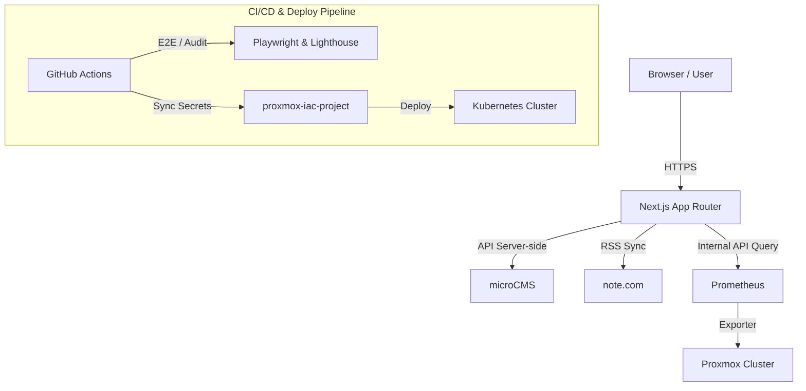

# NAGANUMA Personal Workspace & Homelab Console


Proxmox Cluster / Ubuntu ホームラボ環境と連動した、ターミナル風コンソール型ポートフォリオサイト（`https://naganuma-web.com`）のソースコードです。

---

## Overview & Concept

「**MAKE A BETTER DIGITAL LIFE.**」をコンセプトに掲げ、単なる静的な実績公開サイトではなく、ホームラボのリアルタイムステータスやnoteの最新記事を統合した「デジタルワークスペース・コマンドセンター」として構築されています。

- **Terminal-Style UI**: `neofetch` や `tmux` 風の質感を再現した個性的デザイン
- **Live Telemetry**: Proxmoxクラスタのメトリクスをリアルタイム可視化
- **Unified Output**: note記事の自動取得・同期機能

## Key Features

### Real-time Homelab Telemetry (Prometheus)
- Prometheus APIを経由し、CPU・メモリ・ディスク使用率およびネットワーク通信量（Mb/s）を取得・描画
- **25秒間のサーバーキャッシュ** と **非表示タブでの自動更新停止** により、監視サーバーへのクエリ負荷を最適化
- Prometheus未接続時やローカル環境では、デザイン確認用のサンプルモードへ自動フォールバック

### Automated note Integration
- `NOTE_USER_ID` の設定により、noteのRSSフィードから最新記事を自動取得（最大5分間キャッシュ）
- 外部での情報発信が自サイトトップページへリアルタイムに自動還元される仕組み

### Strict Nonce-based CSP
- リクエストごとに一意の `nonce` を生成し、厳格な Content Security Policy (CSP) を動的適用
- セキュアな配信構造とモダンなWebパフォーマンスを両立

### Bulletproof Testing & Audit
- PlaywrightモックCMS（固定データ13記事）によるE2Eテスト環境を完備
- Lighthouse CIを用いた表示パフォーマンスおよび品質の自動監査を実施

## Architecture



---

## 開発環境とローカル起動

- **Node.js**: `v22.22.2` 推奨（`.nvmrc` あり。v24は`v24.15.0`以上、v26以降も利用可能）
- **パッケージマネージャー**: `npm`

```bash
# 依存関係のインストール
npm install

# 開発サーバーの起動 (http://localhost:3000)
npm run dev

# テスト実行
npm test

# コード検証 (ESLint)
npm run lint

# 本番ビルド検証
npm run build

# E2Eテスト実行 (Playwright)
npm run test:e2e

# Lighthouse監査 (Lighthouse CI)
npm run test:lighthouse
```

表示確認用のサンプルを追加するには、`.env.local` に `SHOW_SAMPLE_CONTENT=true` を設定してサーバーを再起動します。`/projects` と `/notes` では取得済みの記事の後ろにサンプルを各6件追加し、`/about` ではサンプル職歴を表示します。Homeでは実データが3件未満の場合に限り、空いた枠をサンプルで補います。サンプルカードにはリンクを付けません。`false` に戻すと追加表示を停止します。サンプル職歴は開発環境だけで表示され、本番では設定値にかかわらず非表示になります。

## ユニットテスト

`npm test` はサーバー用テスト（`test:server`）とクライアント用テスト（`test:client`）を順に実行します。クライアント側はjsdom上にReactをマウントし、`useInView`の表示率・一度だけの表示・監視解除・非対応環境でのフォールバックを検証します。サーバー用のReact条件はクライアントテストには適用しません。

## E2Eの固定データと失敗時の調査

`npm run build` の後に `npm run test:e2e` を実行します。初回は `npx playwright install --with-deps chromium` でブラウザを用意してください。既存の開発・本番サーバーを停止してから実行します（既定ポート3000、`PORT`で変更可能）。別サーバーを誤って検証しないよう再利用は無効にしています。

Playwright専用サーバーは `e2e/fixtures/mock-cms.mjs` をNodeの`--import`で先に読み込み、サーバー側のmicroCMS通信を固定の13記事へ置き換えます。テスト専用のサービス名・APIキーを使用し、note・Prometheus・追加サンプルを無効にします。本番のアプリコード、通常の`npm start`、Dockerイメージにはこのモックを組み込みません。

ホームの最新3件、一覧の6件→6件→1件、記事本文・メタデータ、前後のページ遷移、直接アクセス、存在しない記事の404画面をデスクトップ・モバイルで確認します。実CMSのデータ変更や秘密情報に依存しません。

実行後は `npx playwright show-report` で `playwright-report/` のHTMLレポートを開けます。失敗時は初回からトレースとスクリーンショットを `test-results/` に保存します。CIでは成功・失敗にかかわらず（キャンセル時を除く）、両ディレクトリを `playwright-results` というActions成果物として14日間保存します。

## 環境変数

環境変数の見本は [`.env.example`](.env.example) を参照してください。

| 変数名 | 必須 | 説明 |
| --- | --- | --- |
| `SHOW_SAMPLE_CONTENT` | 任意 | 開発環境でサンプル記事・職歴を表示する場合は `true` |
| `MICROCMS_SERVICE_DOMAIN` | 任意 | microCMSのサービスドメイン |
| `MICROCMS_API_KEY` | 任意 | microCMSのAPIキー（サーバー側限定） |
| `MICROCMS_PROJECTS_ENDPOINT` | 任意 | プロジェクト記事のエンドポイント（デフォルト: `projects`） |
| `NOTE_USER_ID` | 任意 | noteのクリエイターID |
| `HOMELAB_PROMETHEUS_URL` | 任意 | PrometheusサーバーのURL（未設定時はデモ表示） |
| `HOMELAB_PROMETHEUS_INSTANCE` | 任意 | PrometheusのProxmox exporter対象instanceラベル |
| `HOMELAB_PROMETHEUS_BEARER_TOKEN` | 任意 | Prometheusがbearer tokenを要求する場合のトークン |
| `NEXT_PUBLIC_GOOGLE_ANALYTICS_ID` | 任意 | Google Analytics測定ID（クライアント配信） |

## 検索非掲載・SNS共有・セキュリティヘッダー

正式URLは `lib/site-metadata.ts` の `https://naganuma-web.com` に統一しています。各ページに固有のタイトル・説明・canonical・Open Graph・Twitter Cardを設定し、共通画像は `/og` で1200×630のPNGを生成します。プロジェクト記事は、画像があればその画像と公開日時を使用します。

現在は検索非掲載の方針です。全ページのrobotsメタタグと全レスポンスの `X-Robots-Tag` に `noindex, nofollow` を維持しています。サイトマップやクローラーを遮断するrobots.txtは追加していません。検索公開へ変更する際は、メタタグとヘッダーの両方を見直してください。

`next.config.ts` から `X-Content-Type-Options: nosniff`、`Referrer-Policy: strict-origin-when-cross-origin`、`Permissions-Policy: camera=(), microphone=(), geolocation=()` を配信します。HSTSはTLS終端側の設定確認後に対応します。

本番ビルドには強制適用の `Content-Security-Policy` を追加しています。`proxy.ts` がリクエストごとにnonceを生成し、Next.jsの初期化、ログイン演出、Google Analyticsのスクリプトだけに同じnonceを付与します。Cloudflare Web Analyticsは公式要件に従ってスクリプト配信元と送信先を許可しています。開発サーバーではHMRのノイズを避けるためCSPを配信しません。

CSPを変更するときは、`npm run build` → `npm start` で起動し、初回・再訪問時のログイン演出、ページ遷移、記事画像、Google Analytics、Cloudflare Web AnalyticsをブラウザのConsoleとNetworkで確認してください。nonce方式により全ページが動的レンダリングされます。スタイルは既存の動的インラインスタイルに合わせてインラインを許可し、記事内画像はサニタイズと同様にHTTPSを許可しています。

参考: [Next.js CSPガイド](https://nextjs.org/docs/app/guides/content-security-policy)、[GoogleのCSPガイド](https://developers.google.com/tag-platform/security/guides/csp)、[CloudflareのCSP要件](https://developers.cloudflare.com/fundamentals/reference/policies-compliances/content-security-policies/)。

## microCMSで記事を管理する

[接続手順・APIスキーマ](docs/microcms.md)を参照してください。未接続時のサンプル記事は開発環境だけで表示します。本番で認証情報がない場合は読み込み失敗として扱います。

## noteの記事を表示する

`.env.local` の `NOTE_USER_ID` に、noteプロフィールURL末尾のクリエイターIDを設定します。

```env
NOTE_USER_ID=your_creator_id
```

トップページのNOTES欄に、RSSから取得した最新3記事が表示されます。取得結果は最大5分間キャッシュします。

## HOMELAB STATUSをPrometheusに接続する

Kubernetesにデプロイするコンテナには、環境変数 `HOMELAB_PROMETHEUS_URL` にPrometheusサーバーのURLを設定して渡します。サイトのサーバー側だけがPrometheusへ問い合わせ、ProxmoxノードのCPU・メモリ・ディスク使用率と、VM/LXCの受信・送信速度（Mb/s）および直近10分間の推移を表示します。トップのneofetchには、オンライン・総ノード数、VM/LXC数、合計CPUコア数、全ノードのうち最短の稼働時間、合計使用・総メモリも表示します。画面を開いている間は30秒ごとに更新し、非表示のタブでは更新を止めます。サーバー側では結果を25秒間キャッシュします。CPU使用率はノードのCPU数で重み付けし、メモリとディスクは全ノードの使用量を合計して計算します。複数のProxmox exporterを収集している場合は、`HOMELAB_PROMETHEUS_INSTANCE` で対象の `instance` ラベルを指定できます。

接続できない場合は `OFFLINE` と `--` を表示します。一部のメトリクスだけ取得できた場合は `PARTIAL DATA` を表示します。URLを設定しないローカル開発環境では、デザイン用のサンプル値を表示します。neofetchのOS・ホスト名・CPU・GPUは公開用の構成情報として `app/data/homelab.ts` で管理し、Kernelやパッケージ数は公開しません。

Podからの接続確認は、`kubectl` が使える端末で実行できます。

```bash
kubectl exec deployment/next-app -- node -e 'fetch("$HOMELAB_PROMETHEUS_URL/api/v1/query?query=up", {signal: AbortSignal.timeout(5000)}).then(async r => console.log(r.status, (await r.json()).status)).catch(e => {console.error(e.message); process.exit(1)})'
```

`200 success` 以外やタイムアウトなら、Kubernetes側のPodまたはノードからPrometheusサーバーへの通信経路とファイアウォールを確認してください。

## Kubernetesへのデプロイ

`naganuma-web` リポジトリの GitHub Actions Secrets に `MICROCMS_SERVICE_DOMAIN`、`MICROCMS_API_KEY`、`NOTE_USER_ID`、`INFRA_REPO_PAT`、および本番で Prometheus を接続する場合は `HOMELAB_PROMETHEUS_URL` を設定します。`MICROCMS_PROJECTS_ENDPOINT` は省略時に `projects` を使用します。任意で `HOMELAB_PROMETHEUS_INSTANCE` や `HOMELAB_PROMETHEUS_BEARER_TOKEN`、Google Analytics を使う場合は `NEXT_PUBLIC_GOOGLE_ANALYTICS_ID` も設定します。

`INFRA_REPO_PAT` は `proxmox-iac-project` にアクセスできるトークンが必要です。Fine-grained PAT の場合、同リポジトリへの `Contents: write`（デプロイ通知）と `Secrets: write`（実行時設定の同期）を付与してください。権限が不足すると `Sync runtime secrets to infra repository` が失敗します。

`main` への push 時にサイトのワークフローがイメージをビルドし、実行時設定をインフラリポジトリの Actions Secrets に暗号化して同期してからデプロイを通知します。インフラ側のワークフローが同じ namespace の Kubernetes Secret `next-app-runtime` を更新し、Deployment の Pod に環境変数として渡します。APIキーはイメージやデプロイ通知のペイロードには含めません。インフラ側のワークフローとマニフェストを先に反映してください。
